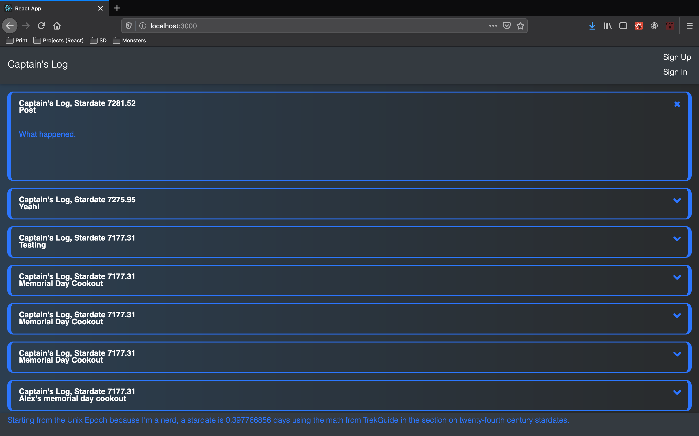
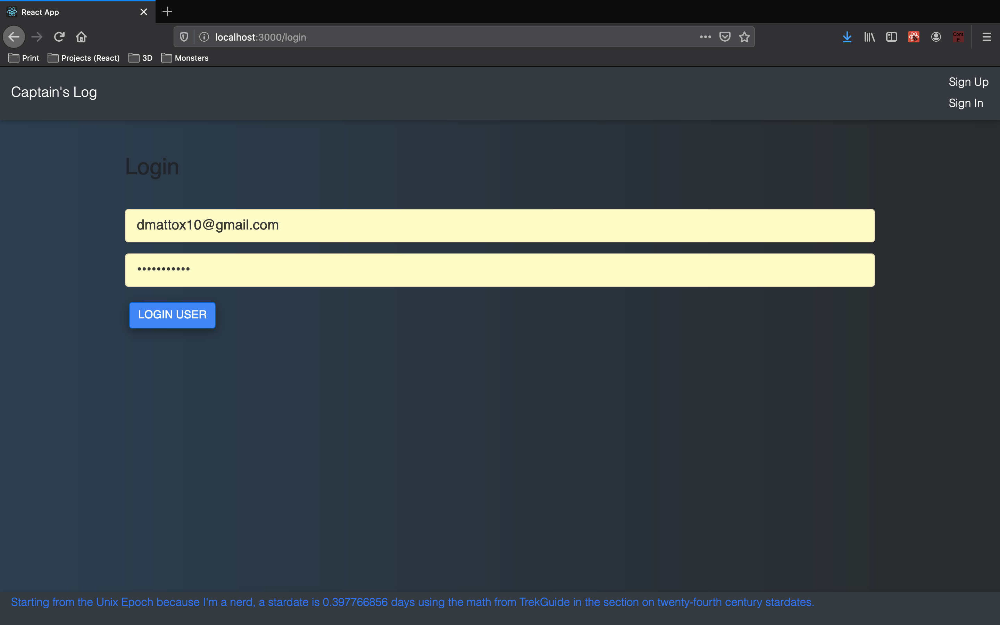

# Captain's Log
## A spin on the good old React Todo List to suit a family inside joke.
### React, Express, MongoDB and a "Stardate"

- Run **yarn** in both the src and api directories
- Adjust the max user signups in api/config/passport.js
- Fill in auth in api/db.js for your MongoDB instance
- Assuming your DB is running, run **yarn start** in both the primary and api directories

### Why isn't this one deployed like the rest of your portfolio?
There's a very high margin for abuse, providing a default username and password as a demo, for people to post hate speech and the like, and the last thing I want is for anyone to log on and see that. So I have a private instance deployed for my wife and I to use, but there will never be a demo, just the screenshots.

### Screenshots:

